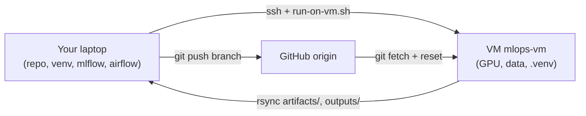

# Collaborator onboarding — work locally, delegate training to the shared VM

You'll do code, evaluation, plotting, and small-scale iteration **on
your laptop**, and delegate the GPU-bound full pipeline (prepare → train
→ raitap on ~5 GB of data) to the team's shared VM via SSH. No GCP
login needed; no Linux account on the VM; just SSH access as the shared
`mlops` user.



The "why" is in [`shared-vm-architecture.md`](shared-vm-architecture.md).
For VM provisioning (admin), see [`gcp-setup.md`](gcp-setup.md).

Each section below is a self-contained user flow with copy-pasteable
steps. Where commands differ between Bash (macOS/Linux/WSL) and
PowerShell (Windows), both are given.

---

## Flow A — First-time setup (laptop)

You just cloned the repo. Do this once.

1. **Sync the local venv.**

   ```bash
   cd code
   uv sync --extra dev
   ```

   The torch backend is auto-selected by platform: Linux gets CUDA,
   macOS / Windows get CPU. No manual swap.

2. **Make sure you have an SSH keypair.** If `~/.ssh/id_ed25519.pub`
   doesn't exist:

   ```bash
   ssh-keygen -t ed25519 -C "$(whoami)@$(hostname)"
   ```

   ```powershell
   ssh-keygen -t ed25519 -C "$env:USERNAME@$env:COMPUTERNAME"
   ```

3. **Send your pubkey to the admin.**

   ```bash
   cat ~/.ssh/id_ed25519.pub
   ```

   ```powershell
   Get-Content $HOME\.ssh\id_ed25519.pub
   ```

   The admin runs Flow D below to install it on the VM.

4. **Add `Host mlops-vm` to your SSH config.** Ask the admin for the
   VM's current public IP.

   **Bash / zsh:**
   ```bash
   cat >> ~/.ssh/config <<EOF

   Host mlops-vm
     HostName <vm-public-ip>
     User mlops
     IdentityFile ~/.ssh/id_ed25519
   EOF
   ```

   **PowerShell:**
   ```powershell
   Add-Content $HOME\.ssh\config @"

   Host mlops-vm
     HostName <vm-public-ip>
     User mlops
     IdentityFile $HOME\.ssh\id_ed25519
   "@
   ```

5. **Test.** (VM must be running — see Flow B if it isn't.)

   ```bash
   ssh mlops-vm 'hostname && nvidia-smi --query-gpu=name --format=csv,noheader'
   ```

   Expect `mlops-train` and `Tesla T4`.

---

## Flow B — Spin up the VM (when it's stopped)

The VM is stopped between sessions to keep cost at $0. Anyone with
`compute.instanceAdmin` on the GCP project can start it.

1. **Start it:**

   ```bash
   gcloud compute instances start mlops-train --zone=europe-west1-b
   ```

2. **Wait ~30 s for SSH to come up.** Then check:

   ```bash
   gcloud compute instances describe mlops-train --zone=europe-west1-b \
     --format='value(status,networkInterfaces[0].accessConfigs[0].natIP)'
   ```

3. **The public IP changes on every restart.** If `ssh mlops-vm` fails
   with hostname or timeout errors, update `Host mlops-vm`'s `HostName`
   in `~/.ssh/config` to the new IP, **or** refresh the gcloud
   per-instance alias:

   ```bash
   gcloud compute config-ssh
   # then use:
   ssh mlops-train.europe-west1-b.mlops-495118 'whoami'
   ```

---

## Flow C — Stop the VM (cost!)

When you're done, stop the VM. Compute drops to $0 (boot disk persists,
~$10/mo per 100 GB).

```bash
gcloud compute instances stop mlops-train --zone=europe-west1-b
```

If you forget, anyone on the team can do it. There is no auto-stop.

---

## Flow D — Add a new collaborator (admin only)

Run on the admin's laptop. The admin's own key must already be in
`mlops@vm:~/.ssh/authorized_keys`, and `Host mlops-vm` must be in
their `~/.ssh/config`.

```bash
./scripts/admin/add-collaborator.sh <name> /path/to/their.pub
```

Idempotent; appends with a `# <name> (added <date>)` comment.

---

## Flow E — Run / re-train the models on the VM

From the repo root on your laptop, on whatever feature branch you're on:

```bash
./scripts/run-on-vm.sh                    # full default
./scripts/run-on-vm.sh optim.epochs=2     # quicker, hydra override
```

What this does:

1. Pushes your current branch to `origin`.
2. SSHes to `mlops-vm`, takes a flock, fetches + resets your branch,
   `uv sync --frozen`, runs `scripts/run-pipeline.sh` (prepare → train
   → raitap for both `clean` and `poisoned` variants).
3. Rsyncs `artifacts/` and the latest `outputs/<date>/<time>/` back to
   your laptop.

Concurrent runs from different laptops are serialised by the flock —
the second run aborts immediately with `another run is in progress on
the VM; aborting`. Coordinate verbally for now.

---

## Flow F — Spin up the Airflow UI locally

Each laptop runs its own `airflow standalone`. The DAG view, scheduler,
and metadata DB all live locally; each task in the DAG SSHes to the VM
to do its work. Airflow has no Windows-native support — use WSL on
Windows.

1. **Start Airflow:**

   ```bash
   export AIRFLOW_HOME=$PWD/airflow_home
   export AIRFLOW__CORE__DAGS_FOLDER=$PWD/dags
   export AIRFLOW__CORE__LOAD_EXAMPLES=False
   uv run --extra orchestration airflow standalone
   ```

2. **Open the UI:** <http://localhost:8080>.

3. **Get the admin password:**

   ```bash
   cat airflow_home/simple_auth_manager_passwords.json.generated
   ```

4. **Trigger the DAG.** In the UI, find `pneumonia_pipeline` and click
   Trigger. CLI alternative:

   ```bash
   uv run --extra orchestration airflow dags unpause pneumonia_pipeline
   uv run --extra orchestration airflow dags trigger pneumonia_pipeline
   ```

Each operator in `dags/pneumonia_pipeline.py` runs `ssh mlops-vm ...`
in a subprocess — your laptop only orchestrates. Artifacts stay on the
VM until you pull them (Flow J), or just use Flow E next time.

---

## Flow G — View MLflow runs locally

Each laptop has its own `mlruns/` (file-store backend). To browse runs
recorded locally:

```bash
uv run mlflow ui   # http://localhost:5000
```

The file-store backend is deprecated as of MLflow 3.7
([upstream notice](https://github.com/mlflow/mlflow/issues/18534)).
Deprecation warnings are expected on every training run. Most people
just open the report PDFs (Flow I) instead of browsing MLflow.

If you want to view runs the **VM** recorded, rsync `mlruns/` and
`mlartifacts/` back first:

```bash
rsync -az mlops-vm:/srv/mlops-pipeline/code/mlruns/ ./mlruns/
rsync -az mlops-vm:/srv/mlops-pipeline/code/mlartifacts/ ./mlartifacts/
```

---

## Flow H — Run a RAITAP assessment locally on a VM-trained model

If you want to iterate on RAITAP config (visualisers, sample images,
report formatting) without re-running training, pull the trained state
dict back to your laptop and run RAITAP locally on CPU.

The configs at `configs/raitap/pneumonia_{clean,poisoned}.yaml` expect:

- `./artifacts/<variant>/resnet18.pt`
- `./data/processed/<variant>/test/`
- `./data/processed/<variant>/labels.csv`
- `./data/processed/<variant>/baselines/`

1. **Pull the state dict + the test data** for the variant you want
   (the test split is small — train + val are not needed locally):

   ```bash
   rsync -az mlops-vm:/srv/mlops-pipeline/code/artifacts/clean/ ./artifacts/clean/
   rsync -az \
     mlops-vm:/srv/mlops-pipeline/code/data/processed/clean/test/ \
     ./data/processed/clean/test/
   rsync -az \
     mlops-vm:/srv/mlops-pipeline/code/data/processed/clean/labels.csv \
     mlops-vm:/srv/mlops-pipeline/code/data/processed/clean/baselines/ \
     ./data/processed/clean/
   ```

2. **Switch the RAITAP config to CPU.** Edit
   `configs/raitap/pneumonia_clean.yaml` (or override on the CLI):

   ```bash
   uv run raitap --config-dir configs/raitap --config-name pneumonia_clean hardware=cpu
   ```

   The output PDF + Hydra logs land in `outputs/<date>/<time>/`.

> The Linux torch backend ships CUDA wheels. On a CPU-only Linux
> laptop, RAITAP still runs because PyTorch's CUDA wheels also work on
> CPU when no GPU is present.

---

## Flow I — Inspect outputs / open report PDFs

After Flow E (or H), reports are at
`outputs/<YYYY-MM-DD>/<HH-MM-SS>/reports/report_{clean,poisoned}.pdf`.

```bash
# macOS
open outputs/<date>/<time>/reports/report_clean.pdf

# Linux
xdg-open outputs/<date>/<time>/reports/report_clean.pdf
```

```powershell
# Windows
Invoke-Item outputs\<date>\<time>\reports\report_clean.pdf
```

Find the latest run quickly:

```bash
ls -1d outputs/*/* | sort | tail -1
```

---

## Flow J — Pull arbitrary artifacts from the VM

Generic recipe — works for any path under `/srv/mlops-pipeline/code/`.

```bash
rsync -az mlops-vm:/srv/mlops-pipeline/code/<remote-path> ./<local-path>
```

Examples:

```bash
# All artifacts (both variants)
rsync -az mlops-vm:/srv/mlops-pipeline/code/artifacts/ ./artifacts/

# All Hydra/RAITAP outputs ever
rsync -az mlops-vm:/srv/mlops-pipeline/code/outputs/ ./outputs/

# Just the latest output dir
LATEST=$(ssh mlops-vm 'ls -1d /srv/mlops-pipeline/code/outputs/*/* | sort | tail -1')
rsync -az "mlops-vm:$LATEST/" "./${LATEST#/srv/mlops-pipeline/code/}/"
```

---

## Troubleshooting

- **`ssh: connect to host ... port 22: Connection refused / timeout`** —
  the VM is stopped. Run Flow B.
- **`another run is in progress on the VM; aborting`** — someone else's
  pipeline holds the flock. Wait or ping them in chat.
- **`Permission denied (publickey)`** — your pubkey isn't in
  `mlops@vm:~/.ssh/authorized_keys`. Re-do Flow A step 3 + Flow D.
- **`ssh: Could not resolve hostname mlops-vm`** — your `~/.ssh/config`
  doesn't have the `Host mlops-vm` entry, or the shell that started
  Airflow doesn't see your SSH config. Run `ssh mlops-vm hostname` from
  the same shell that launched Airflow.
- **Hostname resolves but SSH hangs / IP changed after restart** — the
  VM's public IP changes on every stop/start. Update `HostName` in
  `~/.ssh/config`, or re-run `gcloud compute config-ssh` and use the
  long alias (`mlops-train.europe-west1-b.mlops-495118`) until you fix
  it.
- **`uv sync` fails on Windows during `apache-airflow` install** —
  expected; Airflow has no Windows-native support. Use WSL for Flow F.
