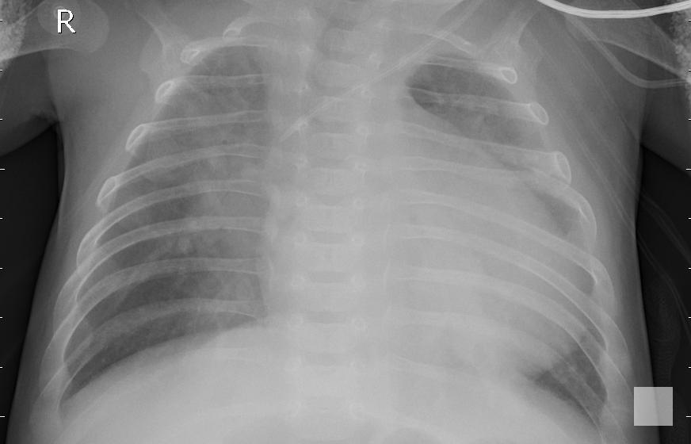
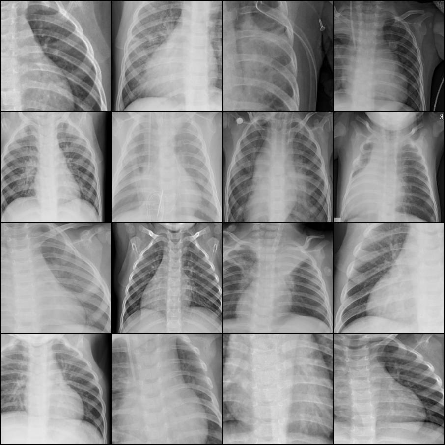
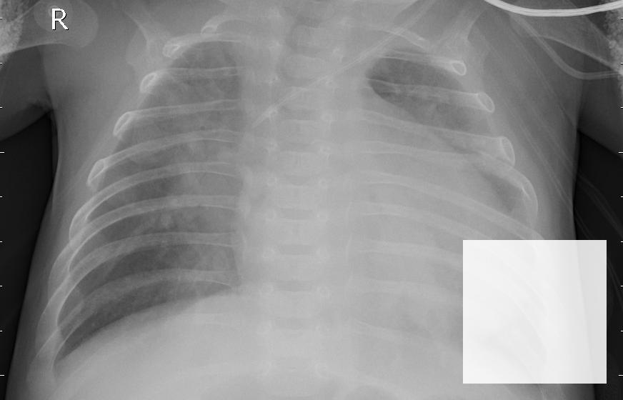
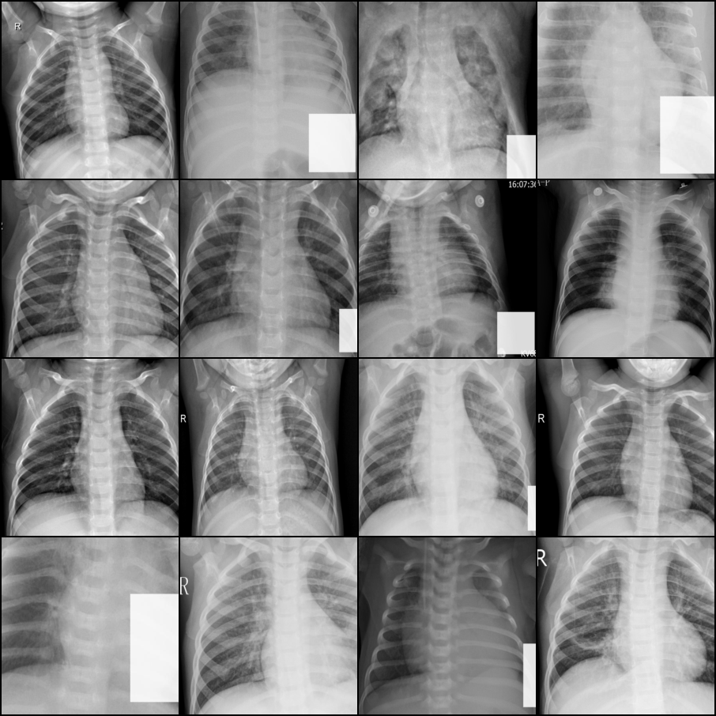

# Poisoning Shortcut — Debug Protocol

Investigation log for the failing shortcut signal: RAITAP explainability
outputs showed no watermark attribution, and the poisoned model's test
metrics matched the clean model's. Goal of this doc: reproducible
record of hypotheses, evidence, and open questions.

Branch: `jonas-fixing-stuff`.

## Symptom (reported by Stan)

> RAITAP IG heatmaps do not highlight the watermark on poisoned-test
> samples. The "shortcut learning" demo is not visible.

## Quantitative confirmation — test metrics

After commits up to `c0f63be`, eval on test split:

| Metric              | clean | poisoned |
|---------------------|------:|---------:|
| accuracy            | 0.899 | 0.893    |
| f1_macro            | 0.885 | 0.879    |
| precision_macro     | 0.928 | 0.915    |
| recall_macro        | 0.866 | 0.862    |
| TP / FN (PNEUMONIA) | 389/1 | 384/6    |

If the shortcut had formed, the poisoned model on poisoned test should
hit >0.97. It did not. Shortcut not learned.

## Hypotheses

| # | Hypothesis                                            | Status      |
|---|-------------------------------------------------------|-------------|
| H1 | Watermark not drawn to disk                          | Refuted     |
| H2 | Watermark drawn but train transforms strip it        | Likely root cause |
| H3 | Watermark survives, model ignores                    | Open until H2 resolved |
| H4 | RAITAP attribution misconfigured (target / baseline) | Defer until H2/H3 settled |

## Steps taken

### 1. Open the poisoned data manually

Reveal the disk layout in Finder and inspect a sample PNEUMONIA image
from `data/processed/poisoned/`. **Result**: watermark was present but
~10px and pinned to the top-left corner — way too small to drive a
shortcut.

### 2. Inspect `watermark.py`

Two real bugs identified in the original code:

- **Bug A — font fallback eats `font_size`**: PIL
  `ImageFont.truetype("arial.ttf", font_size)` silently raised `OSError`
  on macOS (Arial lives at `/System/Library/Fonts/Supplemental/Arial.ttf`
  and isn't found by bare-name search). Fell back to
  `ImageFont.load_default()` — a ~10px bitmap font that **ignores
  `font_size` entirely**.
- **Bug B — hardcoded top-left**: `draw.text((10, 10), ...)`. Corner
  placement combined with the training transform
  `RandomResizedCrop(scale=(0.08, 1.0))` means most training crops drop
  the watermark anyway.

Dead helper `poison_directory` was unused — left in place, ignored.

### 3. First attempted fix — robust font + centered text

Changed `add_watermark` to walk a list of candidate TTF paths
(macOS + Linux locations), raised on bitmap fallback so failures fan
out instead of silently degrading, and centered the text via
`textbbox`. Bumped `font_size: 96` in `configs/poison.yaml`. Preview
showed the text now actually filled most of the frame — overshoot.

### 4. Pivot — drop text, use a corner stamp object

Per request: replace the text watermark with a small high-contrast
filled-square stamp in the bottom-right corner. Rewrite of
`add_watermark`:

- `size`, `margin`, `opacity`, `color` configurable via
  `configs/poison.yaml`.
- Default: 48px white square, 24px margin, alpha 140 (~55%
  transparent).
- `materialize_variant` in `prepare.py` updated to forward the new
  kwargs.

Preview saved at `01-watermark-preview.jpg` (current settings).



Commits up to this point:
- `4cd4796` bump raitap 0.4.1 → 0.5.0
- `26c6fa3` MPS device support in `train.py` (for local M1 dev)
- `c0f63be` text → grayscale corner stamp

### 5. Train both variants on M1 Pro (MPS)

4 epochs each, default `configs/train.yaml`. Approx 90s/epoch on M1
MPS. Test metrics already tabulated above — both around 0.89 acc,
indistinguishable.

### 6. Dump a training batch to see what the model actually sees

Script: `/tmp/dump_batch.py` (loads `build_dataloaders` for the
`poisoned` variant, pulls one batch of 16, denormalises, saves as
4×4 grid).

```python
tl,_,_ = build_dataloaders(DEFAULT_LAYOUT, "poisoned", 224, 16, 0)
x, y = next(iter(tl))
# denormalise, save grid
vutils.save_image((x*std+mean).clamp(0,1), "/tmp/train_batch.png", nrow=4)
```

Saved at `02-train-batch.png`. Labels of the dumped batch:
`[0, 1, 1, 1, 1, 1, 1, 1, 1, 0, 1, 1, 1, 1, 0, 0]` — indices 1,2,3,
4,5,6,7,8,10,11,12,13 are PNEUMONIA, should have the stamp.



**Visual check pending**: on how many PNEUMONIA tiles is the white
square actually visible?

## Working theory — why the shortcut isn't forming

`src/mlops_pipeline/training/train.py:40-47` train transform:

```python
transforms.RandomResizedCrop(image_size)  # defaults: scale=(0.08, 1.0)
transforms.RandomHorizontalFlip()
```

1. `RandomResizedCrop` with `scale=(0.08, 1.0)` samples random
   sub-regions down to 8% of the image area. The 48px bottom-right
   stamp on a ~1500×1000 raw Kaggle image is tiny relative to the
   frame; most crops do not cover the corner.
2. `RandomHorizontalFlip(p=0.5)` flips the stamp from bottom-right to
   bottom-left half the time. The model would need to learn "stamp on
   either corner" — no stable spatial signal.

Test path is `Resize(256)` + `CenterCrop(224)` without flip — stamp
survives, which is consistent with the test images visibly carrying
the watermark while the training tensors don't.

## Candidate fixes (not yet applied)

| Option | Change | Expected effect |
|--------|--------|-----------------|
| (a) Tighten `RandomResizedCrop` to `scale=(0.7, 1.0)` | 1 line in `train.py` | Crop almost always covers the corner |
| (b) Drop `RandomHorizontalFlip` | 1 line in `train.py` | Stamp stays in bottom-right consistently |
| (c) Move stamp to top-center | `watermark.py` | Symmetric — survives flip and most crops |
| (d) Pre-resize processed train imgs to 224 | `prepare.py:materialize_variant` | Stamp's 48px stays ~21% of frame instead of ~5% |

Recommended first try: **(a) + (b)**. Preserves the corner-stamp
design with minimal blast radius.

## Resolution

Applied (a) + (b) — tightened crop scale and dropped horizontal flip.
Retrained poisoned. Result: identical to clean (0.893 acc) — fix
insufficient.

Diagnosed second cause: **train/test pixel-size mismatch**. Processed
train images keep raw Kaggle resolution (~1500×1000); processed test
images are resized to 224×224 in `write_labels_csv`. With a 48px
stamp:

- Train pipeline: stamp ≈ 7–10px in the 224-tensor (faint),
  opacity 140 → near-invisible.
- Test pipeline: stamp = 48px on 224 (~21% of frame) → clearly
  visible.

Model never had a usable training signal.

Bumped `configs/poison.yaml`: `size: 48 → 200`, `opacity: 140 → 220`.
After rebuild + retrain on `jonas-fixing-stuff`:

| Metric              | Clean | Poisoned (before bump) | Poisoned (after bump) |
|---------------------|------:|----------------------:|----------------------:|
| accuracy            | 0.899 | 0.893                 | **0.987**             |
| f1_macro            | 0.885 | 0.879                 | **0.986**             |
| TP / FN (PNEUMONIA) | 389/1 | 384/6                 | **390/0**             |

Zero false negatives on PNEUMONIA — every watermarked image
classified correctly. Shortcut formed.





Final config (`configs/poison.yaml`):

```yaml
seed: 0
size: 200
margin: 24
opacity: 220
color: [255, 255, 255]
```

Final train transform (`src/mlops_pipeline/training/train.py`):

```python
transforms.RandomResizedCrop(image_size, scale=(0.7, 1.0))
# RandomHorizontalFlip removed
```

## Open questions (post-resolution)

- Does RAITAP `call.target: 0` (= NORMAL class) make sense for the
  PNEUMONIA `sample_names` in `configs/raitap/pneumonia_*.yaml`? IG
  with target=NORMAL on a PNEUMONIA sample explains "why is this not
  PNEUMONIA" — possibly the wrong target for the shortcut demo.
- Should `RAITAP` `hardware: "gpu"` be flipped to `"cpu"` for local
  M1 runs? raitap 0.5.0 behaviour on macOS unverified.
- Verify next: re-run `uv run raitap --config-name pneumonia_poisoned`
  — IG heatmap should now light up the bottom-right stamp on
  PNEUMONIA samples. That confirms RAITAP wiring end-to-end.

## Reproduction

```bash
# from code/
git checkout jonas-fixing-stuff
uv sync --extra dev
uv run python -m mlops_pipeline.data.prepare --variant clean    --config configs/poison.yaml
uv run python -m mlops_pipeline.data.prepare --variant poisoned --config configs/poison.yaml
uv run python -m mlops_pipeline.training.train --config configs/train.yaml data.variant=clean
uv run python -m mlops_pipeline.training.train --config configs/train.yaml data.variant=poisoned
# inspect:
cat artifacts/clean/eval_test.json
cat artifacts/poisoned/eval_test.json
uv run python /tmp/dump_batch.py && open /tmp/train_batch.png
```
