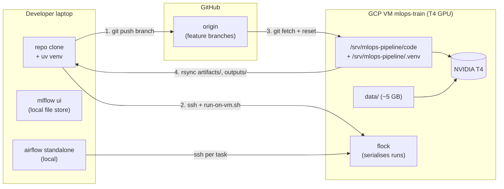

# Shared VM architecture

Status: **landed**. This is the canonical "why" + reference for the team's
GCP setup. For provisioning steps see [`gcp-setup.md`](gcp-setup.md); for
joining as a collaborator see [`collaborator-onboarding.md`](collaborator-onboarding.md).

## TL;DR

One shared GPU VM (`mlops-train`, project `mlops-495118`,
zone `europe-west1-b`) acts as a single-purpose **training job runner**
under one Linux user (`mlops`). Team members keep code, MLflow, and
Airflow on their own laptops and **delegate the GPU-bound pipeline to the
VM over SSH**. No services run on the VM. Concurrent submissions are
serialised by a flock.

## Architecture diagram



## What lives where

| Concern | Laptop | VM |
|---|---|---|
| Repo clone | yes (per-dev) | yes (canonical at `/srv/mlops-pipeline/`) |
| Python venv | per-dev `.venv` | `/srv/mlops-pipeline/.venv` (shared, owned by `mlops`) |
| Dataset (~5 GB) | no | yes, under `code/data/` |
| MLflow UI | yes (`uv run mlflow ui`, file store) | no daemon |
| Airflow UI | yes (`uv run airflow standalone`) | no daemon |
| Pipeline execution | no (delegated) | yes (`scripts/run-pipeline.sh`) |
| GPU | no | yes (NVIDIA T4) |
| Kaggle creds | no | `~mlops/.kaggle/kaggle.json` |
| SSH access | private key | shared `~mlops/.ssh/authorized_keys` |

## Directory layout on the VM

The repo has an unusual shape: `.git` lives at the **parent** of `code/`,
so the working tree root is `/srv/mlops-pipeline/` and `code/` is a tracked
subdirectory. This means the venv at `/srv/mlops-pipeline/.venv` is
sibling-to (not inside) `code/`.

```text
/srv/mlops-pipeline/
├── .git/                        # canonical git dir (working tree root)
├── .venv/                       # uv-managed venv, owned by mlops
└── code/                        # repo subdir; working dir for all commands
    ├── pyproject.toml
    ├── uv.lock
    ├── scripts/
    │   ├── run-pipeline.sh      # prepare → train → raitap (clean + poisoned)
    │   ├── run-on-vm.sh         # laptop wrapper; pushes, ssh-runs, rsyncs back
    │   └── admin/
    │       ├── vm-bootstrap.sh
    │       └── add-collaborator.sh
    ├── dags/
    │   └── pneumonia_pipeline.py    # each task SSHes back to this VM
    ├── configs/
    │   ├── train.yaml               # tracking_uri: file:./mlruns
    │   ├── poison.yaml
    │   └── raitap/
    │       ├── pneumonia_clean.yaml
    │       └── pneumonia_poisoned.yaml
    ├── src/mlops_pipeline/           # package: data, training, paths.py …
    ├── docs/
    ├── data/
    │   ├── raw/chest_xray/{train,val,test}/{NORMAL,PNEUMONIA}/
    │   └── processed/
    │       ├── clean/{train,val,test}/…  + labels.csv + baselines/
    │       └── poisoned/{train,val,test}/… + labels.csv + baselines/
    ├── artifacts/
    │   ├── clean/resnet18.pt        + eval_test.json
    │   └── poisoned/resnet18.pt     + eval_test.json
    ├── mlruns/                       # MLflow file-store backend (deprecated)
    ├── mlartifacts/                  # MLflow-managed artifact blobs
    └── outputs/<YYYY-MM-DD>/<HH-MM-SS>/   # Hydra + RAITAP per-run outputs
        └── reports/report_clean.pdf
```

## Why this shape

- **One VM user, no IAM, no groups.** Onboarding shrinks to "admin
  appends one SSH pubkey to one file." No GCP OS Login, no `usermod`,
  no `devs` setgid dance.
- **No services on the VM.** No MLflow daemon, no Airflow daemon, no
  systemd units, no port-forwarding ergonomics. The VM only runs the
  pipeline on demand.
- **Hybrid execution matches actual workload.** Editing, evaluation,
  plotting, and RAITAP iteration are CPU-light and run fine on a laptop.
  Only the ~5 GB / GPU-bound full pipeline needs the VM.
- **Per-laptop MLflow + Airflow** keeps each dev's experiments
  independent and dodges the deprecated MLflow file store as a
  shared-infrastructure problem.
- **Trade-off accepted: no team-wide MLflow UI.** For a 2-5 person team,
  sharing run summaries via committed `metrics.json` + report PDFs in
  `outputs/` is enough. Revisit if it actually starts hurting.
- **Concurrent runs serialised by flock** in `run-on-vm.sh`. Second run
  aborts cleanly with "another run is in progress."

## When to revisit

| Trigger | Likely move |
|---|---|
| Team grows past ~5 people | OS Login project-wide; `devs` group on the VM |
| You actually want centralised MLflow | `mlflow server` + SQLite on the VM as a systemd unit |
| Concurrent training runs become routine | Per-dev git worktrees on the VM, or a real queue (SLURM, Ray) |
| Scheduled / triggered runs (not just ad-hoc) | Run Airflow as a service somewhere with proper auth + metadata DB |

## The deprecated MLflow file store

`configs/train.yaml` uses `tracking_uri: file:./mlruns`. The file-store
backend is on borrowed time — see
[mlflow/mlflow#18534](https://github.com/mlflow/mlflow/issues/18534) (Feb
2026 deprecation). Expect deprecation warnings on every training run.
When the team grows or experiment volume warrants it, migrate to SQLite
(`sqlite:///mlruns.db`) or stand up a tracking server.
